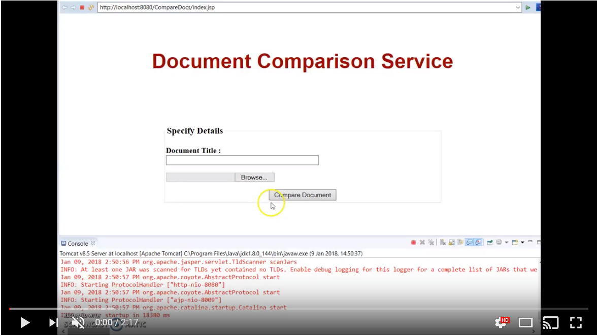

# JEE App lication Comparing Document Similarity

## [Contents](#contents)              
[OverView](#overview)     
[Technology](#tech)                     
[How to run Repository](#repo)  
[How to use Application](#use) 
[Link to video of Application Working](#video)        
[References](#ref) 

## OverView 

For our Project we were required to develop a Java web application that enables two or more text documents to
be compared for similarity. An overview of the system is given below:

## Technology 

The Technology I used for my project are as follows: JSP(Java Servlet Pages), Java Servlets, DB4O and Apache Tomcat. The IDE I used was Eclipse JEE(Java Enterprise Edition).
Here is a short summary of each.

### JSP

Java Server Pages (JSP) is a server-side programming technology that enables the creation of dynamic, platform-independent method for building Web-based applications. JSP have access to the entire family of Java APIs, including the JDBC API to access enterprise databases. Released in 1999 by Sun Microsystems,[1] JSP is similar to PHP and ASP, but it uses the Java programming language.

### Java Servlets

A servlet is a Java programming language class that is used to extend the capabilities of servers that host applications accessed by means of a request-response programming model. Although servlets can respond to any type of request, they are commonly used to extend the applications hosted by web servers. For such applications, Java Servlet technology defines HTTP-specific servlet classes.

### DB4O

db4o represents an object-oriented database model. One of its main goals is to provide an easy and native interface to persistence for object oriented programming languages. Development with db4o database does not require a separate data model creation, the application’s class model defines the structure of the data. db4o attempts to avoid the object/relational impedance mismatch by eliminating the relational layer from a software project. db4o is written in Java and .NET and provides the respective APIs. It can run on any operating system that supports Java or .NET.

### Apache Tomcat

The Apache Tomcat® software is an open source implementation of the Java Servlet, JavaServer Pages, Java Expression Language and Java WebSocket technologies and provides a "pure Java" HTTP web server environment in which Java code can run.

### Eclipse JEE

Eclipse IDE is an integrated development environment (IDE) used in computer programming, and is the most widely used Java IDE. It contains a base workspace and an extensible plug-in system for customizing the environment. Eclipse is written mostly in Java and its primary use is for developing Java applications, but it may also be used to develop applications in other programming languages via plug-ins. The Eclipse JEE(Java Enterprise Edition) version comes with pre-installed plug-ins which better serves working with databases and web applications. 

## How to run Repositiory 

To run my repository/application you will require eclipse jee, apache tomcat server v8.5 and of course java jdk.
Once all setup. Clone the repository to your machine:

1. Create a folder you wish to place the repo.
2. Copy and paste the git clone link in the right corner of the github page.
3. Type the command "git clone " followed by the link.

Import and run project on Eclipse JEE:

1. Import Project into your eclipse JEE.
2. Add Tomcat Server(I used Tomcat 8.5) to the Project. Click [here](http://www.eclipse.org/webtools/jst/components/j2ee/scenarios/running_webproject.html) if you dont know how to add Tomcat server.
3. Next you will have to set you DB_PATH and FILE PATH
    * Find the address for your textFiles Folder and database.data.
    * Then swap the address in the web.xml for DB_PATH and FILE_PATH to your new addresses.
3. Then go to your Project and right click run as, run on server.
4. A pop window should show up and the application should be running.
5. Upload a text document and Click Compare Document.
6. Soon a window will show up and showing the results.

## Link to video of Application Working 

## References 

JSP: [https://docs.oracle.com/javaee/5/tutorial/doc/bnagy.html](https://docs.oracle.com/javaee/5/tutorial/doc/bnagy.html)

JavaServlets: [https://docs.oracle.com/javaee/5/tutorial/doc/bnafe.html](https://docs.oracle.com/javaee/5/tutorial/doc/bnafe.html)

DB4O: [https://en.wikipedia.org/wiki/Db4o](https://en.wikipedia.org/wiki/Db4o)

Apache Tomcat: [http://tomcat.apache.org/](http://tomcat.apache.org/)

Eclipse JEE: [https://www.eclipse.org/](https://www.eclipse.org/)

